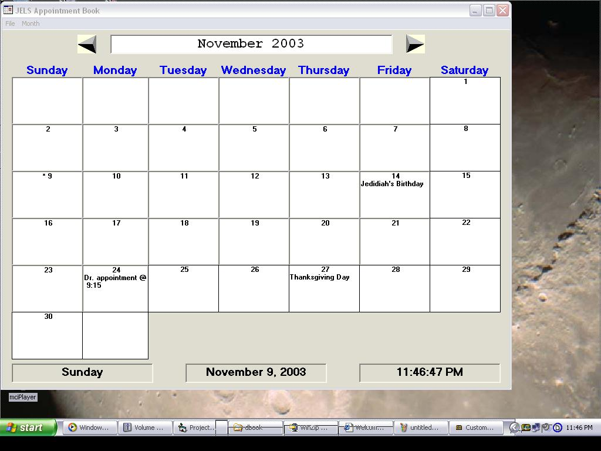



## Appointment Book

### Description

Provides a Monthly Calendar and keeps track of the Important dates and appointments you have.
 
### More Info
 
For a new calendar year just click on new from the file menu and type in the year (i.e. 2003) and the program will create a full years calendar for that year.

             |
---                |---
**Submitted On**   |2003-11-09 21:21:32
**By**             |[Casper Phillips](https://github.com/Planet-Source-Code/PSCIndex/blob/master/ByAuthor/casper-phillips.md)
**Level**          |Beginner
**User Rating**    |4.5 (18 globes from 4 users)
**Compatibility**  |VB 6\.0
**Category**       |[Math/ Dates](https://github.com/Planet-Source-Code/PSCIndex/blob/master/ByCategory/math-dates__1-37.md)
**World**          |[Visual Basic](https://github.com/Planet-Source-Code/PSCIndex/blob/master/ByWorld/visual-basic.md)
**Archive File**   |[Appointmen16701611102003\.zip](https://github.com/Planet-Source-Code/casper-phillips-appointment-book__1-49791/archive/master.zip)

